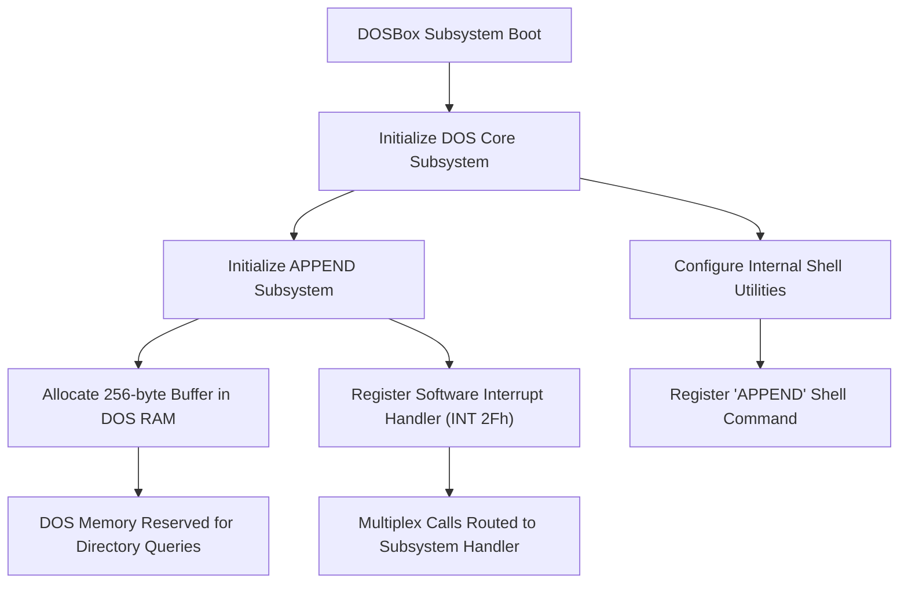
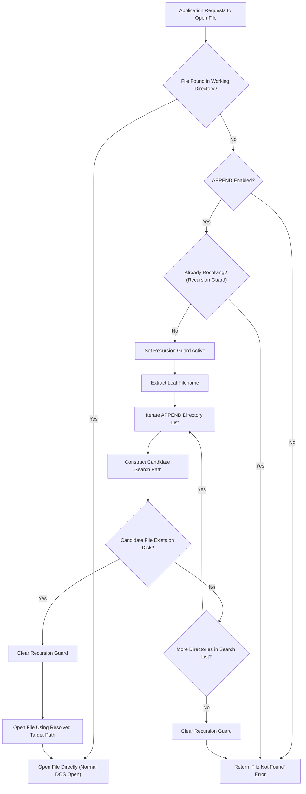
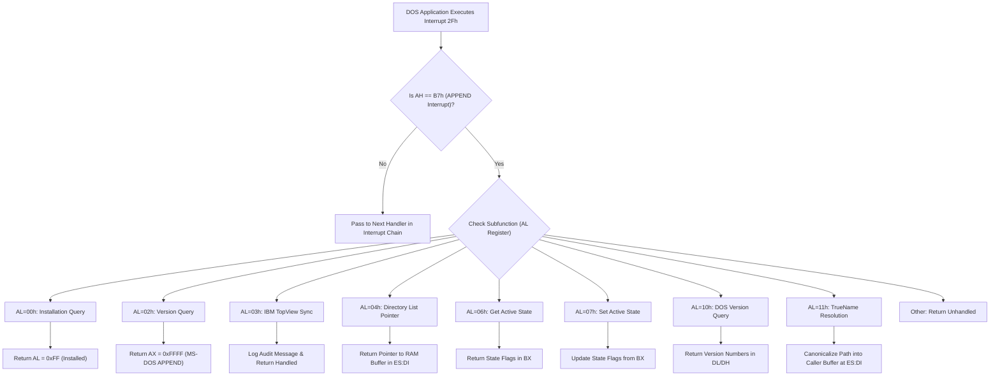
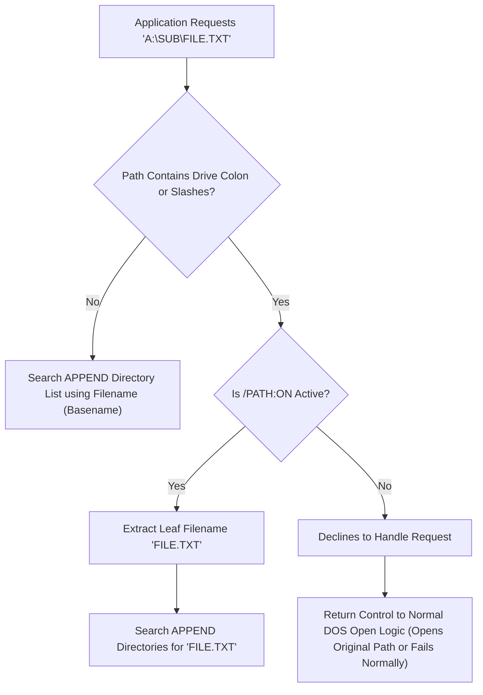

# APPEND Subsystem — Diagrams Reference

This document contains visual flowcharts and subsystem diagrams for the `APPEND` feature. 

> [!TIP]
> **VS Code Markdown Preview Tip:** Standard VS Code markdown preview renders ```mermaid``` blocks as code by default. To render interactive graphical flowcharts directly in VS Code, install the **Markdown Preview Mermaid Support** extension (by Matt Bierner). Visual ASCII text diagrams are also provided below for immediate preview without extensions!

---

## DIAG-01: System Boot and Registration

Shows how the APPEND subsystem registers itself during emulator startup.

```
┌────────────────────────────────────────────────────────────────────────┐
│                        DOSBox Subsystem Boot                           │
└───────────────────────────────────┬────────────────────────────────────┘
                                    │
                                    ▼
┌────────────────────────────────────────────────────────────────────────┐
│                    Initialize DOS Core Subsystem                       │
└───────────────────────────────────┬────────────────────────────────────┘
                                    │
                  ┌─────────────────┴─────────────────┐
                  ▼                                   ▼
┌───────────────────────────────────┐   ┌────────────────────────────────┐
│  Initialize APPEND Subsystem      │   │  Configure Internal Shell      │
└─────────────────┬─────────────────┘   └───────────────┬────────────────┘
                  │                                     │
         ┌────────┴────────┐                            ▼
         ▼                 ▼            ┌────────────────────────────────┐
┌─────────────────┐ ┌───────────────┐   │ Register 'APPEND' Shell Command│
│ Allocate 256B   │ │ Register INT  │   └────────────────────────────────┘
│ in DOS RAM      │ │ 2Fh Handler   │
└────────┬────────┘ └───────┬───────┘
         ▼                  ▼
┌─────────────────┐ ┌───────────────┐
│ DOS Memory      │ │ Multiplex     │
│ Block Reserved  │ │ Calls Routed  │
└─────────────────┘ └───────────────┘
```

<details>
<summary>Click to view Mermaid Diagram</summary>



</details>

---

## DIAG-02: User Command Execution Flow

Sequence of events when a user executes `APPEND C:\DATA;D:\MORE` at the DOS shell prompt.

```
User               Command Shell           APPEND Utility          Directory Validator        DOS Memory
 │                       │                       │                          │                      │
 │─── "APPEND C:\DATA" ─►│                       │                          │                      │
 │                       │─── Launch APPEND ────►│                          │                      │
 │                       │                       │─── Validate Paths ──────►│                      │
 │                       │                       │    ("C:\DATA;D:\MORE")   │── Validate existence │
 │                       │                       │                          │   on mounted drives  │
 │                       │                       │◄── Return Validated ─────│                      │
 │                       │                       │─── Update Path List ───────────────────────────►│
 │                       │                       │    Set active = true     │   Sync string        │
 │                       │◄── Return Success ────│                          │   to DOS RAM         │
```

<details>
<summary>Click to view Mermaid Diagram</summary>

```mermaid
sequenceDiagram
    participant User
    participant Shell as Command Shell
    participant Command as APPEND Command
    participant Parser as Option Parser
    participant Validator as Directory Validator
    participant Subsystem as APPEND Subsystem
    participant Memory as Emulated DOS Memory

    User->>Shell: Executes "APPEND C:\DATA;D:\MORE"
    Shell->>Command: Launch APPEND command
    Command->>Parser: Parse switches (/X, /E, /PATH)
    Parser-->>Command: Validated flags
    Command->>Validator: Validate path list ("C:\DATA;D:\MORE")
    Validator->>Validator: Split by semicolon separator
    Validator->>Validator: Clean whitespace and quotes
    Validator->>Validator: Expand relative paths to absolute paths
    Validator->>Validator: Verify directories exist on mounted drives
    Validator-->>Command: Validated path string
    Command->>Subsystem: Update active directory list
    Subsystem->>Subsystem: Store directory string in memory
    Subsystem->>Subsystem: Enable path resolution
    Subsystem->>Memory: Write updated directory string to DOS RAM
    Command-->>Shell: Return success to prompt
```

</details>

---

## DIAG-03: File Open Fallback & Path Resolution

When a program requests a missing file, APPEND intercepts the lookup and searches the configured directory list.

```
┌────────────────────────────────────────────────────────────────────────┐
│               Application Requests File Open ("README.TXT")            │
└───────────────────────────────────┬────────────────────────────────────┘
                                    │
                                    ▼
                          Is File in Working Dir?
                                 /     \
                               YES     NO
                               /         \
                              ▼           ▼
                     [Open File Directly]  Is APPEND Active?
                                           /           \
                                         NO            YES
                                         /               \
                                        ▼                 ▼
                                [File Not Found]   Check Recursion Guard
                                                          │
                                                          ▼
                                                   Extract Filename
                                                          │
                                                          ▼
                                                   Iterate APPEND List
                                                          │
                                                          ▼
                                                   Candidate Exists?
                                                    /           \
                                                  YES           NO
                                                  /               \
                                                 ▼                 ▼
                                        [Open Target Path]   [Next Dir / Fail]
```

<details>
<summary>Click to view Mermaid Diagram</summary>



</details>

---

## DIAG-04: Multiplex Interrupt Dispatch (INT 2Fh, AH=B7h)

Routing software multiplex interrupts sent to APPEND by DOS applications.

```
                        DOS Interrupt 2Fh Executed
                                    │
                                    ▼
                            Is AH == B7h?
                             /        \
                           NO         YES
                           /            \
                          ▼              ▼
                 [Chain Next Handler]   Check Subfunction (AL)
                                         ├─ AL=00h ─► Return AL=0xFF (Installed)
                                         ├─ AL=02h ─► Return AX=0xFFFF (MS-DOS APPEND)
                                         ├─ AL=03h ─► Log Audit Message & Return Handled
                                         ├─ AL=04h ─► Return ES:DI Pointer to DOS RAM Buffer
                                         ├─ AL=06h ─► Return State Flags in BX
                                         ├─ AL=07h ─► Update State Flags from BX
                                         ├─ AL=10h ─► Return Version Numbers in DL/DH
                                         └─ AL=11h ─► Canonicalize Path into ES:DI Buffer
```

<details>
<summary>Click to view Mermaid Diagram</summary>



</details>

---

## DIAG-07: /PATH:ON vs /PATH:OFF Resolution Logic

Determines whether APPEND processes file requests that contain explicit drive specifiers or directory paths.

```
                      Application Requests "A:\SUB\FILE.TXT"
                                         │
                                         ▼
                        Contains Drive Colon or Slashes?
                                     /       \
                                   NO        YES
                                   /           \
                                  ▼             ▼
               [Search List using Basename]  Is /PATH:ON Active?
                                                /           \
                                              YES           NO
                                              /               \
                                             ▼                 ▼
                                     [Search APPEND List]  [Declines to handle; returns to normal DOS open]
```

<details>
<summary>Click to view Mermaid Diagram</summary>



</details>

---

## DIAG-08: Subsystem File Organization

```
┌─────────────────────────────────────────────────────────────────┐
│                    DOSBox-Staging Source Tree                    │
├─────────────────────────────────────────────────────────────────┤
│                                                                 │
│  src/dos/programs/append.h ──── Class declaration (APPEND)      │
│  src/dos/programs/append.cpp ── Shell command parser & UI       │
│                                                                 │
│  src/dos/dos_append.h ───────── Public API (dos_append namespace)│
│  src/dos/dos_append.cpp ─────── Core logic, state & interrupts  │
│                                                                 │
│  src/dos/dos_files.cpp ──────── Fallback hook in DOS_OpenFile    │
│  src/dos/dos.cpp ────────────── Subsystem boot registration     │
│  src/dos/dos_programs.cpp ───── Shell utility registration      │
│  src/dos/CMakeLists.txt ─────── Target build rules              │
│                                                                 │
│  tests/dos_append_tests.cpp ─── Google Test suite (32 tests)    │
│  tests/files/append/ ────────── Static test fixture directories  │
│                                                                 │
└─────────────────────────────────────────────────────────────────┘
```
