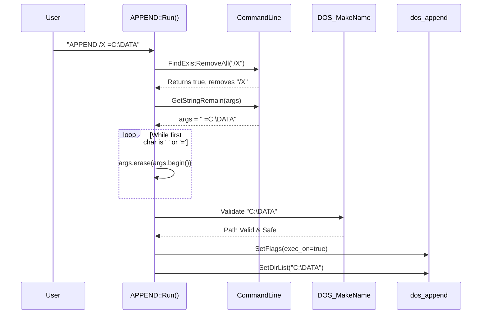
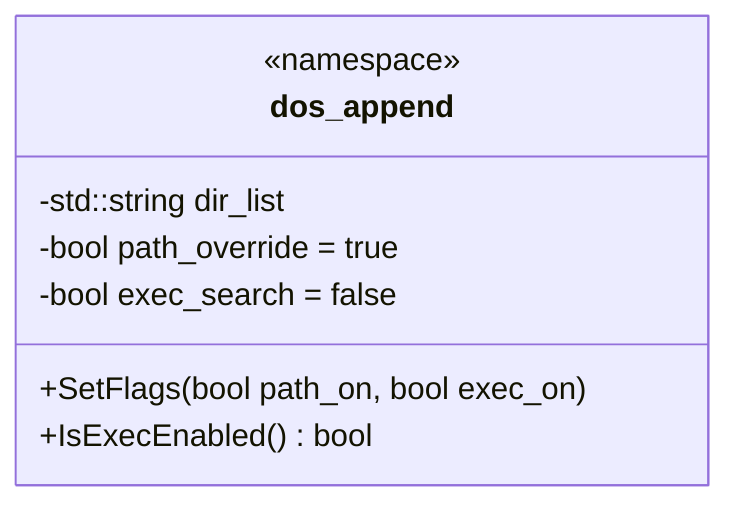
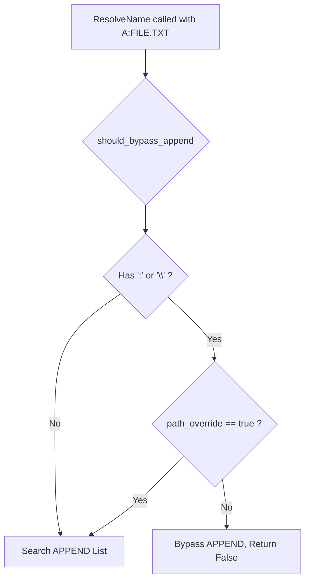
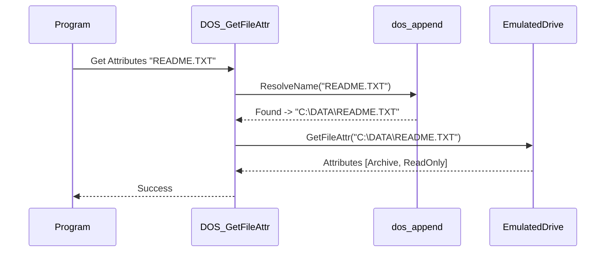
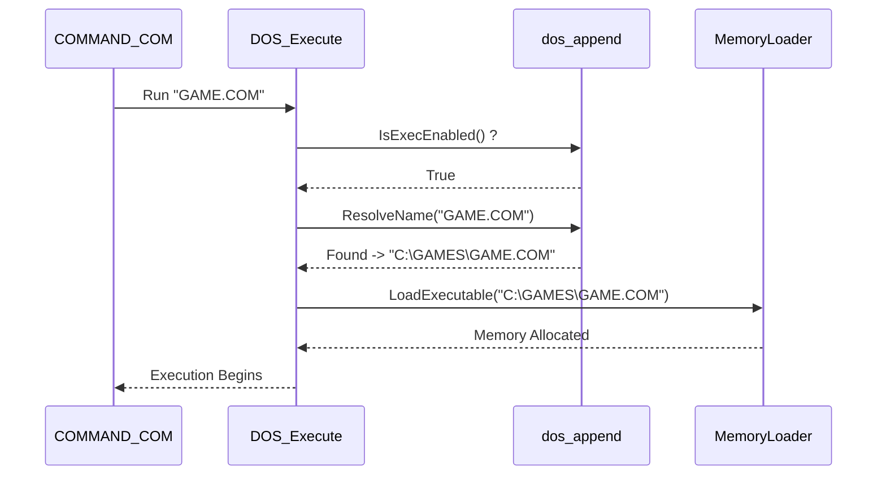

> [!NOTE]
> **Historical snapshot - may not match current implementation.** See [append_consolidated_report.md](../append_consolidated_report.md) for the current authoritative specification.

# Detailed APPEND Execution Framework

This document is a comprehensive technical breakdown of every change required for Phase 2. It includes detailed execution traces, security assurances against malicious input, and UML diagrams for every section to ensure the flow is easy to follow.

---

## 1. Command Line Parsing and Security

### Context
The `APPEND.EXE` program receives raw text from the user via the `CommandLine` class. You expressed concern about parsing and malicious input. 

### How DOSBox-Staging Parses the String
Unlike native MS-DOS which forces developers to manually scan a raw memory buffer string from the command line for characters, DOSBox-Staging abstracts this safely into the `CommandLine` C++ class. 

When `APPEND.EXE` is executed, the DOS kernel passes it a `CommandLine* cmd` object. We use two specific functionalities of this class in the execution trace below:
1. `cmd->FindExistRemoveAll(string)`: This scans the entire command line, safely removes the requested flag (like `/X`), and returns `true` if it was found. This prevents malicious string injection because we only look for exact, predefined switches.
2. `cmd->GetStringRemain(args)`: This securely dumps whatever is left of the command line into a standard `std::string` for us to manipulate, completely preventing buffer overflows.

For your personal knowledge, the `CommandLine` class acts as a robust utility belt for parsing arguments across the entire DOSBox-Staging codebase. However, MS-DOS `APPEND` is unique: it relies on semicolons (`;`) and equals signs (`=`) instead of spaces. 

*(To answer your curiosity: `FindInt` wouldn't work for `/X:ON` because it specifically looks for a standalone number after a flag, like `-cycles 3000`. And because MS-DOS APPEND's syntax is so strangely delimited, we have to do the semicolon tokenization ourselves!)*

Here is a quick reference table of some of its other highly useful functions, and why they don't fit our exact needs here:

| Function Signature | Description | Why we don't use it for APPEND | Example of what it expects |
| :--- | :--- | :--- | :--- |
| `bool FindString(name, &value, remove)` | Finds a string argument and assigns the result to `value`. | It expects space-separated values, not colons. | `-conf dosbox.conf` |
| `bool FindInt(name, &value, remove)` | Finds a flag and parses the integer immediately following it. | `/X:ON` is a string, not an integer separated by a space. | `-cycles 3000` |
| `std::vector<std::string> GetArguments()` | Returns a standard vector containing all parsed arguments. | It splits by spaces! If a user types `APPEND C:\; D:\`, it shatters the path array. | `mount c .` -> `["mount", "c", "."]` |
| `const char* GetFileName()` | Returns the name of the executable that was launched. | We don't need to know the program is called "APPEND". | `Z:\APPEND.EXE` |
| `void Shift(amount = 1)` | Shifts the internal argument list forward, similar to bash. | We don't iterate by shifting, we just dump the remaining string. | Removing the first arg in a loop. |

### Path Validation and Existence Verification
Once we have extracted our flags using this class, we use `DOS_MakeName`. This is a hardened DOSBox kernel function. It sanitizes the string, checks for illegal DOS characters, and restricts the path strictly to the emulated mounted drives. If a user tries a malicious path traversal (like `../../windows/system32`), `DOS_MakeName` will either reject it as an invalid DOS path or trap it safely inside the emulated `C:` drive.

**Do we verify if the directory exists?** Yes! After `DOS_MakeName` sanitizes the path, our code immediately calls `Drives[drive]->TestDir(fullname)`. This physically checks the emulated filesystem. If the user types `APPEND C:\NONEXISTENT`, `TestDir` returns false, and the parser instantly aborts, printing "Invalid path". The state is never modified. 

(Note: If a program sets the APPEND path *programmatically* via the INT 2Fh multiplex interrupt instead of the command line, DOSBox-Staging accepts the string raw, but safely ignores any missing directories later during the file search phase).

### MS-DOS Delimiter Authenticity
In authentic MS-DOS, the command interpreter (`COMMAND.COM`) and the internal `APPEND` assembly routines treat the equals sign (`=`), the comma (`,`), and the space (` `) as interchangeable whitespace delimiters. Consequently, commands such as `APPEND /X C:\DATA`, `APPEND /X=C:\DATA`, and `APPEND /X =C:\DATA` are perfectly valid and structurally identical to the DOS kernel. Trimming the equals sign during our tokenization phase ensures that DOSBox-Staging authentically replicates this historical parsing behavior.

### Execution Trace (Parsing `APPEND /X =C:\DATA`)
1. **Input:** Raw string `"/X =C:\DATA"` enters `APPEND::Run()`.
2. **Flag Extraction:** `cmd->FindExistRemoveAll("/X")` scans the string. It finds `/X`, removes it, and returns `true`.
3. **String Remaining:** The remaining string is ` =C:\DATA`.
4. **Equal Sign Trimming:** A while loop detects the leading space and `=`, erasing them. String becomes `C:\DATA`.
5. **Tokenization:** The string is split by `;`. The token `C:\DATA` is extracted.
6. **Sanitization:** `C:\DATA` is passed to `DOS_MakeName`. It is validated against mounted drives.
7. **Commit:** Because validation succeeded, `dos_append::SetFlags()` is called, and the directory list is updated.

### UML Diagram: Parser Flow

---

## 2. Core APPEND State Changes

### Context
We must store the user's flag preferences in the backend. 
**Do these changes mean we need to change our existing code?** Yes. We will add new variables to the anonymous namespace in `dos_append.cpp`, create a new setter/getter, and slightly modify one existing `if` statement in `should_bypass_append()`.

### Execution Trace (State Storage)
1. `APPEND::Run()` calculates the final boolean values for `path_on` and `exec_on`.
2. `APPEND::Run()` calls `dos_append::SetFlags(path_on, exec_on)`.
3. Inside `dos_append.cpp`, the anonymous variables `path_override` and `exec_search` are overwritten with the new values.

### UML Diagram: State Modification

---

## 3. Path Override Logic (`/PATH:ON`)

### Context
Currently, `should_bypass_append()` instantly skips APPEND if the requested filename has a drive letter or slash. We need to respect the `/PATH:ON` flag to act like MS-DOS 4.0+.

*   **The Context:** A program requests `A:FILE.TXT` via `DOS_OpenFile`.
*   **The Action:** We modify `should_bypass_append` to check `if (path_override)` before rejecting paths with colons/slashes.
*   **The Result:** `should_bypass_append` returns `false` (meaning: do *not* bypass).
*   **The Resulting State:** The path is passed into the `ResolveName` search loop.
*   **The Why:** MS-DOS 4.0 changed the specification to force APPEND to search its directories even if the user explicitly typed a drive letter, making APPEND much more powerful for lazy software.
*   **The Lasting Result:** The DOS kernel successfully opens `C:\APPEND_DIR\FILE.TXT` instead of failing to find `A:FILE.TXT`.

### Execution Trace (Resolving `A:FILE.TXT` with `/PATH:ON`)
1. Program calls `DOS_OpenFile("A:FILE.TXT")`.
2. `DOS_OpenFile` calls `dos_append::ResolveName("A:FILE.TXT")`.
3. `ResolveName` calls `should_bypass_append("A:FILE.TXT")`.
4. `should_bypass_append` sees the `:` character.
5. It checks `path_override`. It is `true`.
6. It returns `false` (do not bypass).
7. `ResolveName` strips the `A:` and searches the APPEND list for `FILE.TXT`.

### UML Diagram: Path Override Decision

---

## 4. Hooking File Attributes (`DOS_GetFileAttr`)

### Context
Programs (like `COMMAND.COM`) check if a file exists before opening it using the "Get Attributes" API. If we don't hook this, the program will think the appended file doesn't exist.

### Execution Trace (Attribute Checking)
1. Program calls INT 21h AH=43h (Get Attributes).
2. DOSBox calls `DOS_GetFileAttr(name)`.
3. We inject `dos_append::ResolveName(name, resolved)`.
4. The file is found in the APPEND list, `resolved` contains the true path.
5. `DOS_GetFileAttr` uses `resolved` to successfully return the file's attributes.

### UML Diagram: Attribute Hook

---

## 5. Hooking Executable Loader (`DOS_Execute`)

### Context
For `/X:ON` to work, the DOS Kernel must be able to load and run `.EXE` and `.COM` files that reside inside the APPEND directories.

### Execution Trace (Executing a Program)
1. User types `GAME` at the DOS prompt.
2. `COMMAND.COM` calls `DOS_Execute("GAME.COM")`.
3. We inject `if (dos_append::IsExecEnabled() && dos_append::ResolveName(name, resolved))`.
4. If `/X:ON` was used, `IsExecEnabled()` is `true`.
5. The executable is found in the APPEND list.
6. DOSBox loads the executable into memory using the `resolved` path.

### UML Diagram: Execution Hook

