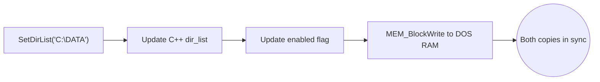

> [!NOTE]
> **Historical snapshot - may not match current implementation.** See [append_consolidated_report.md](../append_consolidated_report.md) for the current authoritative specification.

# Understanding the APPEND Implementation: A Glossary-Driven Report

This report explains the technical terms and concepts behind our decision to implement APPEND as native C++ code inside DOSBox instead of emulating the original MS-DOS TSR binary.

---

## The Core Concept: Two Worlds

DOSBox is essentially two computers running at once:

| World | What it is | Memory |
| :--- | :--- | :--- |
| **The Emulated World** | A fake 1990s PC running inside DOSBox. DOS programs live here. They think they're running on real hardware. | 640KB of simulated RAM (called **conventional memory**). |
| **The Host World** | Your actual Windows PC running DOSBox. Our C++ code lives here. | Gigabytes of real RAM. |

The fundamental problem: **programs in the Emulated World cannot see or touch anything in the Host World**, and vice versa, unless we explicitly build a bridge.

---

## Term: TSR (Terminate and Stay Resident)

A TSR is a DOS program that loads itself into conventional memory, sets up interrupt hooks, and then "terminates" — but instead of freeing its memory, it stays loaded. It becomes a background service.

Think of it like a Windows system tray app: the user runs it once, and it stays running silently in the background, responding to events.

In the original MS-DOS, `APPEND.EXE` was a TSR. It loaded into the emulated 640KB, hooked `INT 21h` and `INT 2Fh`, and sat there intercepting file operations.

**Our approach**: We skip all of that. Instead of loading a fake binary into the fake RAM, we write the logic directly in C++ on the host side. The emulated DOS programs never know the difference because we still respond to the same interrupts.

---

## Term: Conventional Memory (640KB)

```
┌─────────────────────────────┐  1MB
│   Upper Memory (384KB)      │
│   (ROMs, video memory, etc) │
├─────────────────────────────┤  640KB
│                             │
│   Conventional Memory       │
│   (Where DOS programs live) │
│                             │
│   ← TSRs load here too     │
│   ← Every byte counts      │
│                             │
├─────────────────────────────┤  0KB
│   Interrupt Vector Table    │
└─────────────────────────────┘
```

This is the 640KB of RAM that DOS programs share. Every TSR that loads eats into this space. In the 1990s, users would spend hours tweaking `CONFIG.SYS` and `AUTOEXEC.BAT` to free up conventional memory so games could run.

**Why this matters for us**: By not loading a TSR, we don't consume any of this precious space. A game that needs 590KB of conventional memory won't be blocked by our APPEND implementation.

---

## Term: Far Pointer (`ES:DI`)

In 16-bit DOS, memory addresses are expressed as two 16-bit numbers: a **Segment** and an **Offset**. Together they form a "far pointer" that can address up to 1MB of memory.

| Register | Role | Example Value |
| :--- | :--- | :--- |
| `ES` | Segment (which 64KB block) | `0x1234` |
| `DI` | Offset (where within that block) | `0x0056` |
| **Real Address** | `(ES × 16) + DI` | `0x12396` |

When a DOS program calls subfunction `04h` ("give me the APPEND directory list"), it expects us to put a far pointer into `ES:DI` that points to a string **inside the emulated 640KB**. The program will then read bytes from that address.

**The problem**: Our `dir_list` is a C++ `std::string`. It lives in the Host World (your real PC's RAM at some address like `0x7FFA12340000`). A 16-bit DOS program cannot address that. It's like trying to mail a letter to a ZIP code that doesn't exist.

**The fix (if we ever need it)**: We would use `DOS_GetMemory` to carve out a chunk of the emulated 640KB, copy our C++ string into that chunk using `MEM_BlockWrite`, and then tell the DOS program "here, the string is at this segment:offset."

---

## Term: `DOS_GetMemory`

This is a DOSBox-internal C++ function that allocates memory **inside the emulated 640KB space**. It's the bridge between our two worlds.

**How it works internally** (from [dos_tables.cpp](file:///c:/Users/andtr/Documents/GitHub/dosbox-staging-attempt3/dosbox-staging/src/dos/dos_tables.cpp)):

```cpp
// DOSBox maintains a pointer (dos_memseg) that starts at the
// beginning of a reserved "private" region inside the 640KB.
// Each call to DOS_GetMemory bumps this pointer forward.

uint16_t DOS_GetMemory(uint16_t pages) {
    uint16_t page = dos_memseg;   // Current position
    dos_memseg += pages;          // Advance the pointer
    return page;                  // Return the segment number
}
```

The returned value is a **segment number** — the first half of a far pointer. When we call `DOS_GetMemory(1)`, we get a 16-byte paragraph inside the emulated 640KB that DOS programs can read.

```
Host World (C++)              Emulated World (DOS)
┌──────────────┐              ┌──────────────┐
│ std::string  │  ──copy──►   │ 640KB RAM    │
│ "C:\DATA"    │              │ addr: 1234h  │
└──────────────┘              └──────────────┘
                              ES:DI = 1234:0000
```

Other DOSBox subsystems that already use this pattern:

| Subsystem | What it stores in DOS memory |
| :--- | :--- |
| **MSCDEX** (CD-ROM driver) | Device driver headers and read buffers |
| **DOS Tables** | DBCS table, collating sequences, filename characters |
| **FAT driver** | DTA (Disk Transfer Area) for image-based drives |

For APPEND, we would call `DOS_GetMemory` once during `Init()` to reserve space for the directory list string.

---

## Term: `MEM_BlockWrite`

Once `DOS_GetMemory` has reserved a block inside the emulated 640KB, we need a way to actually write bytes into it. That's what `MEM_BlockWrite` does.

`DOS_GetMemory` gives us a **segment number** (an address). `MEM_BlockWrite` takes that address and copies raw bytes from our C++ memory into the emulated RAM:

```cpp
// Signature:
void MEM_BlockWrite(PhysPt pt, const void* data, size_t size);

// Usage example for APPEND:
PhysPt dos_addr = (dirlist_segment << 4);          // Convert segment to physical address
MEM_BlockWrite(dos_addr, dir_list.c_str(),          // Source: our C++ string
               dir_list.size() + 1);                // +1 for the null terminator
```

Think of it as `memcpy`, but instead of copying between two C++ buffers, it copies from the Host World into the Emulated World:

```
Host World                    Emulated World
┌───────────────────┐         ┌───────────────────┐
│ dir_list.c_str()  │         │ Segment 1234h     │
│                   │         │                   │
│ C : \ D A T A \0 │ ─────►  │ C : \ D A T A \0 │
│                   │         │                   │
└───────────────────┘         └───────────────────┘
   C++ std::string               DOS-visible RAM
```

---

## Concept: Memory Synchronization (C++ ↔ DOS)

Because our APPEND lives in two worlds simultaneously, we need to keep the directory list in sync between them. This is a **one-directional push** from C++ to DOS memory:



### Why one-directional?

| Direction | Scenario | Does it happen? |
| :--- | :--- | :--- |
| **C++ → DOS** | User types `APPEND C:\DATA` at the prompt. `SetDirList()` fires. | **Yes.** Every `SetDirList()` call pushes to DOS memory. |
| **DOS → C++** | A program gets the `ES:DI` pointer via `04h` and writes new bytes directly into that memory. | **No.** The MS-DOS documentation treats this pointer as read-only. No known software modifies the list this way. |

### The sync lifecycle

```
1. Init()
   └─ DOS_GetMemory(pages)    ← Reserves a block in the emulated 640KB
   └─ Saves the segment number in a static variable

2. SetDirList("C:\DATA;D:\MORE")
   └─ dir_list = "C:\DATA;D:\MORE"            ← Updates C++ copy
   └─ enabled = true                           ← Updates C++ flag
   └─ MEM_BlockWrite(segment, string, length)  ← Pushes to DOS copy

3. MultiplexHandler(), AL=04h
   └─ reg_es = saved_segment                   ← Points DOS program
   └─ reg_di = 0                                  to the DOS copy
   └─ return true
```

Because `SetDirList()` is the **only** function that ever modifies the directory list, and we add the `MEM_BlockWrite` call inside it, the two copies can never drift apart. There is exactly one writer and it always updates both.

---

## Term: MCB Chain (Memory Control Block)

When DOS allocates memory for a program or TSR, it creates a small header block called a **Memory Control Block (MCB)** right before the allocated memory. These MCBs are linked together in a chain (like a linked list), forming a map of everything loaded in conventional memory.

```
MCB → Program A (COMMAND.COM)
 ↓
MCB → TSR (MOUSE.COM)
 ↓
MCB → TSR (APPEND.EXE)    ← A real TSR would appear here
 ↓
MCB → Free Memory
```

Diagnostic tools like `MEM /C` walk this chain to show you what's loaded and how much memory each program uses. Since our APPEND never loads into conventional memory, it has no MCB entry. `MEM /C` will not list it.

**Impact**: Zero. No game ever walks the MCB chain looking for APPEND. This only affects diagnostic tools that a user might run out of curiosity.

---

## Term: `MEM /C`

`MEM` is a DOS command that shows memory usage. The `/C` flag classifies memory by program name. Example output on a real DOS machine:

```
Name           Total      Conventional   Upper Memory
--------  ----------------  --------  --------
MSDOS      16,157   (16K)   16,157   (16K)       0    (0K)
HIMEM       1,168    (1K)    1,168    (1K)       0    (0K)
MOUSE       5,984    (6K)        0    (0K)    5,984   (6K)
APPEND      4,320    (4K)    4,320    (4K)       0    (0K)  ← Would show this
```

In DOSBox with our native implementation, the APPEND line simply won't appear. The user gets that 4KB back for free.

---

## Summary Table

| Term | What it means | Why it matters for APPEND |
| :--- | :--- | :--- |
| **TSR** | A program that stays loaded in memory after "exiting" | The original APPEND was a TSR. We skip this entirely. |
| **Conventional Memory** | The 640KB of RAM DOS programs share | We save ~4KB by not loading a TSR binary. |
| **Far Pointer (ES:DI)** | A 16-bit segment:offset address pair | Subfunction `04h` needs one. Our C++ string can't provide one directly. |
| **DOS_GetMemory** | DOSBox function to allocate emulated RAM | Reserves a block inside the 640KB for our directory list string. |
| **MEM_BlockWrite** | Copies bytes from C++ into emulated RAM | The tool that pushes our `dir_list` string into DOS-visible memory. |
| **Memory Sync** | Keeping C++ and DOS copies identical | One-directional push from `SetDirList()` ensures both copies always match. |
| **MCB Chain** | Linked list of memory allocations in DOS | Our APPEND is invisible to it. No games care. |
| **MEM /C** | DOS diagnostic command | Won't show APPEND. Cosmetic only. |

