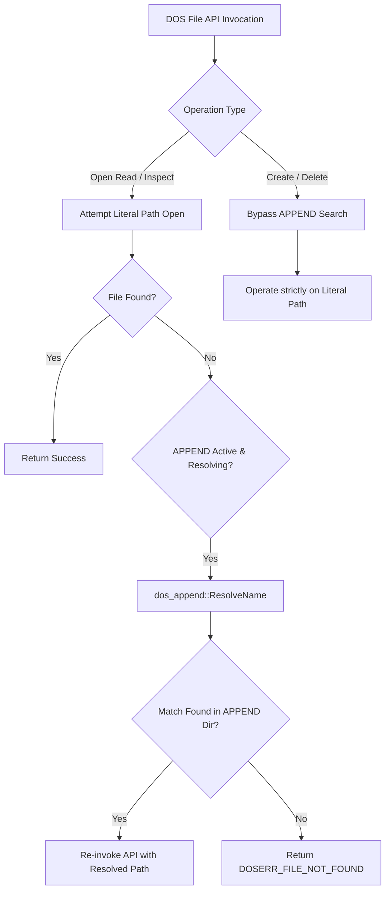

> [!NOTE]
> **Historical snapshot - may not match current implementation.** See [append_consolidated_report.md](../append_consolidated_report.md) for the current authoritative specification.

# Architectural Report: `dos_append::ResolveName` Integration in `dos_files.cpp`

This report provides a technical analysis of why `dos_append::ResolveName` is invoked within [dos_files.cpp](file:///c:/Users/andtr/Documents/GitHub/dosbox-staging-attempt3/dosbox-staging/src/dos/dos_files.cpp), detailing the exact MS-DOS API functions intercepted, the functional rationale for each call site, and the intentional exclusion of file creation/deletion operations.

---

## 1. Executive Summary

In MS-DOS, `APPEND` acts as a transparent directory lookup hook for data files. When an application attempts to access a file that does not exist in the current working directory (or at the specified target path), the DOS file system sub-system delegates the lookup to `APPEND`.

In DOSBox-Staging, file system operations are handled centrally by [dos_files.cpp](file:///c:/Users/andtr/Documents/GitHub/dosbox-staging-attempt3/dosbox-staging/src/dos/dos_files.cpp). `dos_append::ResolveName` is called at **three strategic interception points** corresponding to standard MS-DOS file inspection interrupts (INT 21h).



---

## 2. Detailed Analysis of Call Sites in `dos_files.cpp`

### Call Site 1: `DOS_OpenFile` (Line 897) — INT 21h, AH=3Dh

```cpp
bool DOS_OpenFile(const char* name, uint16_t flags, uint16_t* entry, bool fcb)
{
	// 1-4. Canonicalize path & attempt opening on target drive
	Files[handle] = Drives.at(drive)->FileOpen(fullname, flags);

	if (Files[handle]) {
		// Literal path open succeeded!
		Files[handle]->AddRef();
		if (!fcb) psp.SetFileHandle(*entry, handle);
		return true;
	} else {
		// Literal path open failed -> Try APPEND resolution!
		if (!dos_append::IsResolving() && dos_append::IsEnabled()) {
			std::string resolved = {};
			if (dos_append::ResolveName(name, resolved)) {
				// Recursively open the resolved full path
				return DOS_OpenFile(resolved.c_str(), flags, entry, fcb);
			}
		}

		// File missing everywhere -> Set original DOS error
		if (!PathExists(name)) DOS_SetError(DOSERR_PATH_NOT_FOUND); 
		else DOS_SetError(DOSERR_FILE_NOT_FOUND);
		return false;
	}
}
```

#### Why it exists:
* **Primary Interception Point:** `DOS_OpenFile` is the primary workhorse of DOS file I/O. When a DOS game calls `open("CONFIG.DAT")` or `fopen("C:\GAME\DATA.PAK")` and the file is not at that literal path, `ResolveName()` searches each appended directory in order.
* **Secondary Order Rule:** `ResolveName()` is only called in the `else` branch (after literal path opening fails). This guarantees that files in the current working directory always take priority over appended directories.
* **Recursion Safety:** `!dos_append::IsResolving()` prevents infinite recursive loops when `DOS_OpenFile` re-invokes itself with `resolved.c_str()`.

---

### Call Site 2: `DOS_GetFileAttr` (Line 997) — INT 21h, AH=4300h

```cpp
bool DOS_GetFileAttr(const char* const name, FatAttributeFlags* attr)
{
	std::string append_path;
	const char* actual_name = name;
	if (dos_append::ResolveName(name, append_path)) {
		actual_name = append_path.c_str();
	}

	char fullname[DOS_PATHLENGTH];
	uint8_t drive;
	if (!DOS_MakeName(actual_name, fullname, &drive)) {
		return false;
	}

	if (Drives.at(drive)->GetFileAttr(fullname, attr)) {
		return true;
	} else {
		*attr = 0;
		DOS_SetError(DOSERR_FILE_NOT_FOUND);
		return false;
	}
}
```

#### Why it exists:
* **Attribute Inspection:** Legacy DOS applications (such as WordPerfect, Lotus 1-2-3, and game launchers) check if a file exists or is read-only by inspecting its FAT attributes (`INT 21h, AH=4300h`) before issuing `DOS_OpenFile`.
* **Consistency:** If `DOS_GetFileAttr("DATA.PAK")` returned `FILE_NOT_FOUND` while `DOS_OpenFile("DATA.PAK")` succeeded, programs would assume a file system error and crash. Calling `ResolveName()` ensures metadata queries match file open operations.

---

### Call Site 3: `DOS_SetFileAttr` (Line 1020) — INT 21h, AH=4301h

```cpp
bool DOS_SetFileAttr(const char* const name, FatAttributeFlags attr)
{
	std::string append_path;
	const char* actual_name = name;
	if (dos_append::ResolveName(name, append_path)) {
		actual_name = append_path.c_str();
	}

	char fullname[DOS_PATHLENGTH];
	uint8_t drive;
	if (!DOS_MakeName(actual_name, fullname, &drive))
		return false;
	// ... apply attribute updates ...
}
```

#### Why it exists:
* **Attribute Modification:** Allows software to modify file attributes (e.g. toggling Read-Only or Archive flags) on files located in appended directories.

---

## 3. Why File Creation & Deletion Exclude `ResolveName`

`dos_append::ResolveName` is **intentionally omitted** from `DOS_CreateFile` (Line 800) and `DOS_UnlinkFile` (Line 975):

```cpp
// DOS_CreateFile in dos_files.cpp
bool DOS_CreateFile(const char* name, uint16_t attribute, uint16_t* entry)
{
    // NO ResolveName call! Files are ALWAYS created at the target path.
    // ...
}
```

### Architectural Rationale:
1. **MS-DOS Specification Requirement:** In authentic MS-DOS, `APPEND` **only intercepts read and metadata inspection operations**.
2. **Preventing File Overwrites:** If `DOS_CreateFile("SAVE.DAT")` resolved to `C:\SHARED_LIB\SAVE.DAT`, creating a save file in the current working directory would corrupt or overwrite shared master data files in appended directories.
3. **Atomic File Creation:** New files and temporary files must always be written to the local active working directory or explicit destination drive.

---

## 4. Summary Matrix of `dos_files.cpp` Interceptions

| DOS File API Function | INT 21h Subfunction | Uses `ResolveName`? | Rationale |
| :--- | :--- | :--- | :--- |
| **`DOS_OpenFile`** | `AH=3Dh` | **YES** | Primary data file search & read redirection |
| **`DOS_GetFileAttr`** | `AH=4300h` | **YES** | File existence & metadata queries |
| **`DOS_SetFileAttr`** | `AH=4301h` | **YES** | Modifying attributes of appended files |
| **`DOS_CreateFile`** | `AH=3Ch` / `AH=5Bh` | **NO** | Prevents writing/overwriting in search paths |
| **`DOS_UnlinkFile`** | `AH=41h` | **NO** | Prevents accidental deletion of shared files |

