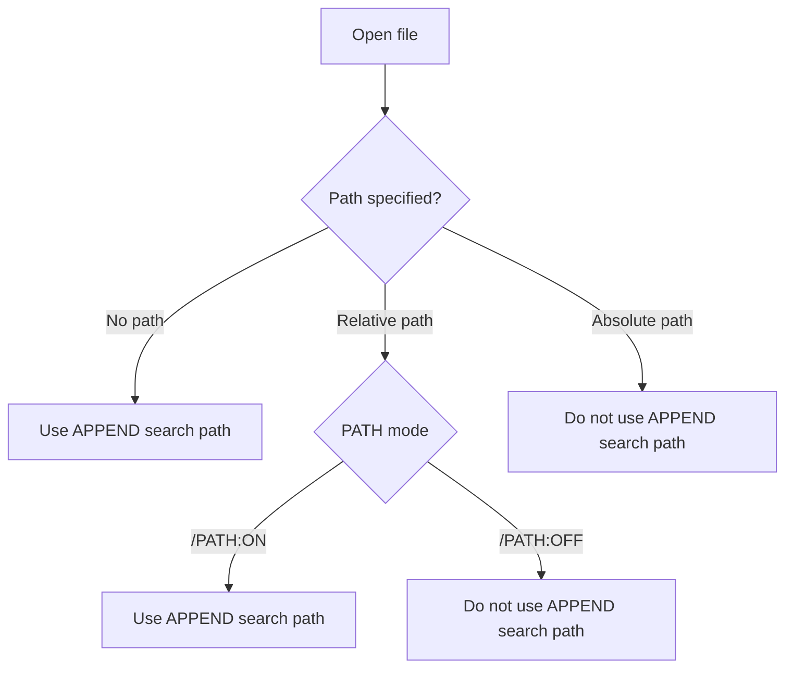

> [!NOTE]
> **Historical snapshot - may not match current implementation.** See [append_consolidated_report.md](../append_consolidated_report.md) for the current authoritative specification.

# MS-DOS APPEND Functionality Research: /PATH:ON vs /PATH:OFF

This research report documents the exact behavior, functional rules, and path extraction mechanics of the MS-DOS `APPEND` command under `/PATH:ON` and `/PATH:OFF` modes.



---

## 1. Overview & Historical Background

The `APPEND` utility was introduced in MS-DOS 3.2 to allow DOS programs to open data files located in directories outside the current working directory, similar to how the `PATH` environment variable works for executable files.

In MS-DOS 4.0+, Microsoft expanded `APPEND` with the `/PATH` switch:
* **`/PATH:ON` (Default in MS-DOS 4.0+)**: Allows `APPEND` to search appended directories even if the program provides an explicit drive letter or directory path.
* **`/PATH:OFF`**: Restricts `APPEND` to unqualified filenames only (filenames without drive letters or directory slashes).

---

## 2. DOSBox-Staging Implementation Behavior & Lifecycle

### Boot Default & Persistence
1. **Boot Initialization (`append_path_flag = true`):**  
   When DOSBox-Staging starts up or resets, `append_path_flag` is initialized to `true` (matching MS-DOS 4.0+ factory defaults).
2. **Indefinite Runtime Persistence:**  
   Within an active session, path override mode **remains in its current state continuously** across all program launches, DOS commands, and file operations. If set to `APPEND /PATH:OFF`, it stays OFF for all subsequent commands in that session until manually changed.
3. **Reboot / System Reset Behavior:**  
   If the user reboots or restarts the emulator, `/PATH:OFF` is **not preserved**. System state variables re-initialize to factory defaults, so `append_path_flag` **turns back ON by itself** (`append_path_flag = true`), and the directory search list is cleared back to empty (`""`).
4. **Directory List Dependency (`enabled` state):**  
   Path resolution only performs directory searching when `APPEND` is active (`enabled == true`, i.e., at least one directory path is set via `APPEND C:\DIR`).
   * When `dir_list` is empty, `ResolveName()` returns `false` immediately.
   * As soon as a directory is set (e.g. `APPEND C:\DATA`), `/PATH:ON` is immediately active. Any missing file—whether requested as `FILE.TXT`, `SUBDIR\FILE.TXT`, or `C:\DATA\FILE.TXT`—is intercepted and searched in `C:\DATA`.

---

## 3. Functional Requirements & Behavioral Specifications

## Functional Requirement: Basename Extraction for APPEND Lookups

When APPEND processes a file lookup request that includes an explicit path while `/PATH:ON` is enabled, the system shall use only the final filename component for APPEND search-path resolution.

The system shall ignore any directory prefixes in the requested path, whether absolute or relative. For example, `C:\DATA\SUBDIR\FILE.TXT` and `..\MYDIR\FILE.TXT` shall both be treated as `FILE.TXT` for APPEND lookup purposes.

The system shall not expand relative subdirectories within APPEND search-path entries. For example, if the APPEND search list contains `D:\LIB`, then the system shall test `D:\LIB\FILE.TXT` only, and shall not attempt `D:\LIB\SUBDIR\FILE.TXT`.

## Expected Behavior

1. If the request contains no path, APPEND search-path resolution is applied directly to the filename.
2. If the request contains a relative or absolute path and `/PATH:ON` is enabled, only the basename is retained.
3. APPEND search-path entries are matched against the basename only.
4. APPEND does not append or preserve subdirectories from the original request when forming search candidates.

## Functional Requirement: Literal Path Evaluation Order
For any file request containing a path under `/PATH:ON`:
1. **Primary Check:** DOS first attempts to find the file at the literal target location specified by the program (e.g. `C:\DATA\FILE.TXT`).
2. **Secondary Interception:** If and only if the file does **not** exist at that literal location, `APPEND` intercepts the failure, extracts the bare filename (`"FILE.TXT"`), and searches each directory in the `APPEND` list in left-to-right order.

## Functional Requirement: /PATH:OFF Strict Bypass Rule
Under `/PATH:OFF`, if a requested filename contains **any** of the following characters:
* Drive colon `:` (e.g., `D:FILE.TXT`)
* Backslash `\` (e.g., `SUBDIR\FILE.TXT` or `\FILE.TXT`)
* Forward slash `/` (e.g., `SUBDIR/FILE.TXT`)

`APPEND` **bypasses search completely**. If the file does not exist at the literal path specified, DOS immediately returns `DOSERR_FILE_NOT_FOUND` without checking any appended directories.

## Functional Requirement: File Opening vs. File Creation
* **Read / Inspection Operations:** `APPEND` intercept rules apply to file open calls (`DOS_OpenFile`), attribute checks (`DOS_GetFileAttr`), and program execution (`DOS_Execute` when `/X:ON` is set).
* **Write / Creation Operations:** `APPEND` **never** intercepts file creation (`DOS_CreateFile`) or deletion (`DOS_UnlinkFile`). New files are always created in the current working directory or explicit target path to prevent accidental overwriting of shared files in appended directories.

---

## 4. Behavioral Comparison Matrix

| Scenario / Request String | File Exists at Target? | `/PATH:OFF` Behavior | `/PATH:ON` Behavior (Default) |
| :--- | :--- | :--- | :--- |
| `DOS_OpenFile("FILE.TXT")` | Yes (Current Dir) | Opens `FILE.TXT` in current dir | Opens `FILE.TXT` in current dir |
| `DOS_OpenFile("FILE.TXT")` | No | Searches `APPEND` search path | Searches `APPEND` search path |
| `DOS_OpenFile("C:\DATA\FILE.TXT")` | Yes (At `C:\DATA\`) | Opens `C:\DATA\FILE.TXT` | Opens `C:\DATA\FILE.TXT` |
| `DOS_OpenFile("C:\DATA\FILE.TXT")` | No | Returns `FILE_NOT_FOUND`<br/>*(Bypasses `APPEND`)* | Extracts `FILE.TXT`<br/>**Searches `APPEND` search path** |
| `DOS_OpenFile("SUBDIR\FILE.TXT")` | No | Returns `FILE_NOT_FOUND`<br/>*(Bypasses `APPEND`)* | Extracts `FILE.TXT`<br/>**Searches `APPEND` search path** |
| `DOS_OpenFile("..\FILE.TXT")` | No | Returns `FILE_NOT_FOUND`<br/>*(Bypasses `APPEND`)* | Extracts `FILE.TXT`<br/>**Searches `APPEND` search path** |
| `DOS_CreateFile("FILE.TXT")` | N/A | Creates `FILE.TXT` in current dir | Creates `FILE.TXT` in current dir |

---

## 5. Implementation in DOSBox-Staging & Call Sequence

### Candidate Path Construction (`try_resolve_in_directory`)

To make the code completely self-documenting, the helper function responsible for testing directory entries is named **`try_resolve_in_directory(dir, basename, out_path)`**:

1. **Path Formatting & Verification (`try_resolve_in_directory`):**  
   `try_resolve_in_directory(dir, basename, out_path)` takes a directory entry from the `APPEND` search list (e.g. `dir = "C:\APPEND_LIB"`), trims trailing slashes, and combines it with `basename` (`"FILE.TXT"`).  
   It forms candidate string `"C:\APPEND_LIB\FILE.TXT"` and checks `DOS_FileExists(candidate.c_str())`. If found on disk, it assigns the resolved full path `out_path = "C:\APPEND_LIB\FILE.TXT"` and returns `true`.

2. **Resolution Engine Confirmation (`ResolveName`):**  
   `ResolveName` receives `true` from `try_resolve_in_directory()`, sets `currently_resolving = false`, and returns `true`. The reference string parameter `out_path` passed by caller now holds `"C:\APPEND_LIB\FILE.TXT"`.

3. **Recursive Re-invocation (`DOS_OpenFile`):**  
   In [dos_files.cpp](file:///c:/Users/andtr/Documents/GitHub/dosbox-staging-attempt3/dosbox-staging/src/dos/dos_files.cpp), `DOS_OpenFile()` receives `true` from `ResolveName()`. It takes the resolved full path (`resolved = "C:\APPEND_LIB\FILE.TXT"`) and calls `DOS_OpenFile(resolved.c_str(), flags, entry, fcb)` recursively.  
   This second invocation opens `"C:\APPEND_LIB\FILE.TXT"` directly on drive `C:`, assigns a file handle, and returns `true` to the calling DOS game/application!

```cpp
// Checks if combining 'dir' and 'basename' points to an existing file, updating
// 'out_path' with the resolved path if found.
bool try_resolve_in_directory(std::string_view dir, const std::string& basename,
                              std::string& out_path)
{
	std::string_view trimmed_dir = dir;
	if (!trimmed_dir.empty() &&
	    (trimmed_dir.back() == '\\' || trimmed_dir.back() == '/')) {
		trimmed_dir.remove_suffix(1);
	}

	auto candidate = std::string(trimmed_dir) + "\\" + basename;
	if (DOS_FileExists(candidate.c_str())) {
		out_path = candidate; // Populates out_path with resolved full filename!
		return true;
	}
	return false;
}

// Runtime Resolution Engine
bool ResolveName(const char* name, std::string& out_path)
{
	if (!enabled || currently_resolving) {
		return false;
	}

	if (should_skip_append_resolution(name)) {
		return false;
	}

	auto basename = extract_basename(name);
	if (basename.empty()) {
		return false;
	}

	currently_resolving = true;
	std::string current_list = GetDirList();
	std::string_view sv      = current_list;

	for (const auto& subrange : sv | std::views::split(';')) {
		std::string_view dir(subrange.begin(), subrange.end());
		if (dir.empty()) continue;

		// try_resolve_in_directory appends basename to dir ("C:\APPEND_LIB" + "\" + "FILE.TXT")
		// and tests if file exists on disk, populating out_path on success.
		if (try_resolve_in_directory(dir, basename, out_path)) {
			currently_resolving = false;
			return true; // Found match in APPEND dir! out_path contains full resolved path.
		}
	}

	currently_resolving = false;
	return false;
}
```

---

## 6. End-to-End Execution Trace of `out_path` & Range Pipe Mechanics

### End-to-End Execution Trace of `out_path`

```
      [DOS_OpenFile()] in dos_files.cpp
             │
 1. Define   │  std::string resolved = {};  (Allocated on caller's stack)
             │
 2. Pass     │  dos_append::ResolveName("HELP.TXT", resolved);
             â–¼
      [dos_append::ResolveName()] in dos_append.cpp
             │
             │  bool ResolveName(const char* name, std::string& out_path)
             │                                    └──────┬──────┘
             │                     Alias to 'resolved' on caller's stack!
             │
 3. Loop     │  for (const auto& subrange : sv | std::views::split(';')) {
             │      try_resolve_in_directory(dir, basename, out_path);
             â–¼
      [try_resolve_in_directory()] in dos_append.cpp
             │
             │  auto candidate = "C:\DATA\HELP.TXT";
             │  if (DOS_FileExists(candidate)) {
 4. Assign   │      out_path = candidate;   (Populates 'resolved' in DOS_OpenFile!)
             │      return true;
             │  }
             â–¼
 5. Consume  [DOS_OpenFile()] receives true and opens 'resolved' ("C:\DATA\HELP.TXT")!
```

---

### C++20 Range Pipe Adaptor Mechanics (`sv | std::views::split(';')`)

The pipe character `|` in `sv | std::views::split(';')` is the **C++20 Range Adaptor Composition Operator**:

```cpp
for (const auto& subrange : sv | std::views::split(';')) {
```

1. **Syntax Equivalence:**  
   `sv | std::views::split(';')` is syntactic sugar for `std::views::split(sv, ';')`. The pipe operator passes the range on the left (`sv`) into the range adaptor on the right.
2. **Zero-Copy Performance:**  
   Because `sv` is a `std::string_view`, the pipe operator creates a lightweight range view wrapper with **zero memory allocations**. Each `subrange` in the `for` loop yields iterators (`begin`, `end`) pointing directly into the existing character buffer of `sv`.


