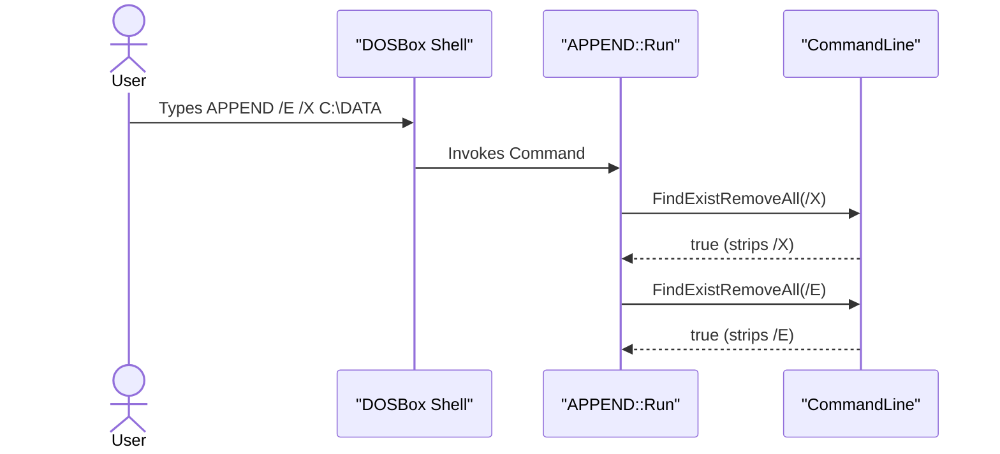
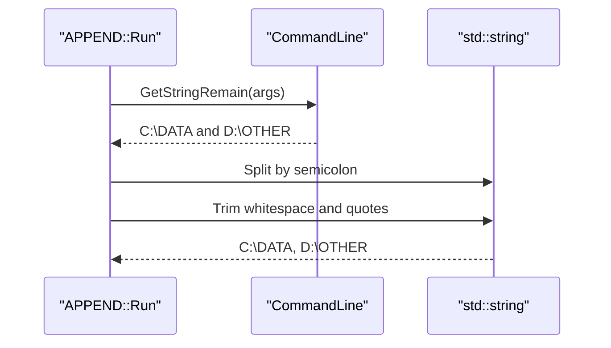
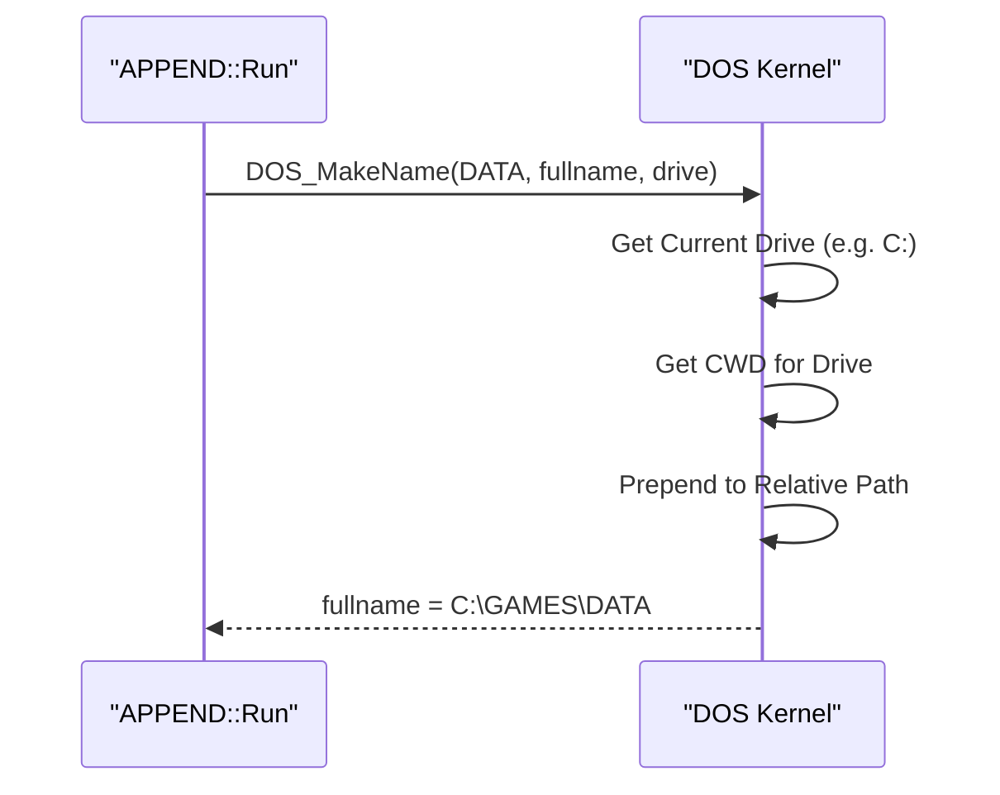
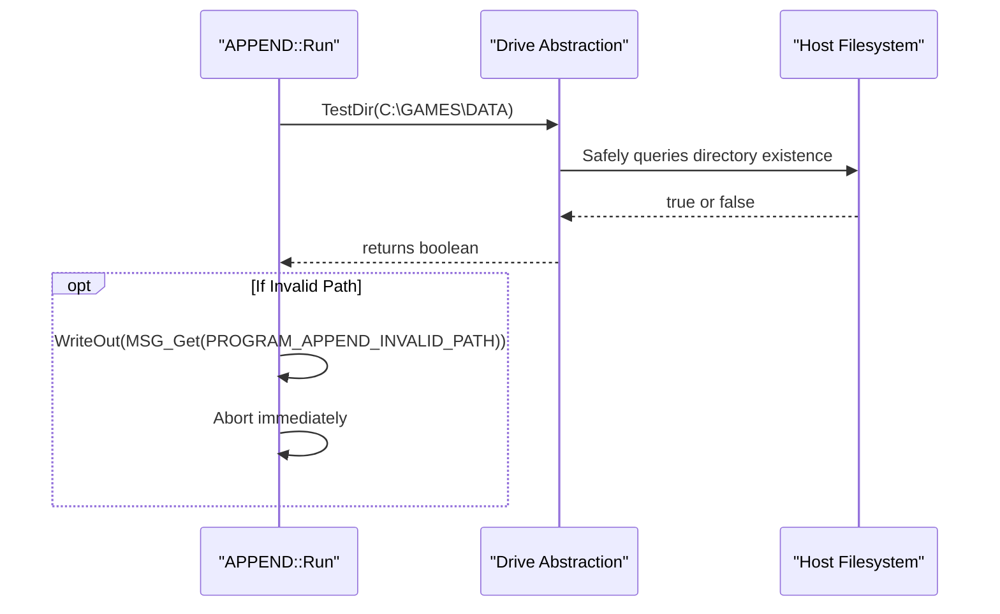
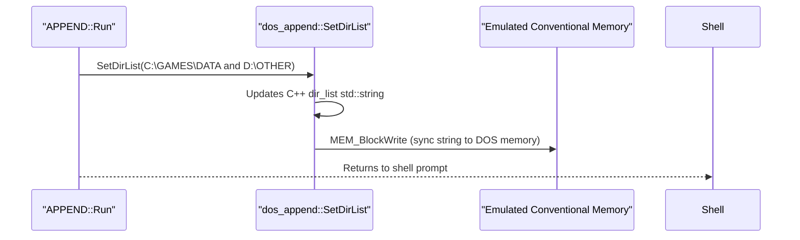

> [!NOTE]
> **Historical snapshot - may not match current implementation.** See [append_consolidated_report.md](../append_consolidated_report.md) for the current authoritative specification.

# APPEND Command-Line Parsing and Verification Plan

## Goal
Detail all the areas where the command-line directory list for the `APPEND` command must be parsed and normalized, and establish a plan to verify the implementation. 

If we receive directory lists programmatically, they might already be well-formed. But when entered by a user via the DOSBox shell prompt (e.g., `APPEND C:\DIR`), we must ensure the list is cleaned, verified, and normalized properly so it can be safely used by the APPEND subsystem.

## Finalized Design Decisions (from User Feedback)
- **Switches to Extract**: We will extract `/X`, `/X:ON`, `/X:OFF`, `/E`, `/PATH:ON`, `/PATH:OFF`. Our parser (`CommandLine::FindRemoveStringArgument` or `FindExistRemoveAll`) removes them regardless of whether they appear before or after the directory list.
- **Invalid Directories**: The `APPEND.SKL` open-source MS-DOS reference contains the exact string `"Invalid path"`. We will use DOSBox's internal `DOS_MakeName` and `DOS_FileExists` or directory-equivalent functions to verify paths. While DOSBox has a generic `"Illegal path.\n"` message (`SHELL_ILLEGAL_PATH`), we will register a specific `PROGRAM_APPEND_INVALID_PATH` message containing `"Invalid path\n"` in `APPEND::AddMessages()` to match native behavior perfectly. If an invalid directory is provided, we will output this message and abort.
- **Absolute Path Resolution & Drive Safety**: Yes, we will expand relative paths. To address concerns about different drive types (read/write, CD-ROMs, floppy images): DOSBox's `DOS_MakeName()` is purely an in-memory function that safely prepends the current working directory of the specified drive. It does not hit the host filesystem directly. After resolving the string, we will call `Drives[drive]->TestDir()`. This is DOSBox's robust abstraction layer that safely queries the specific drive (whether it's a read-only CD-ROM or local mount) to ensure the directory actually exists. If it's an unmounted drive, `DOS_MakeName` instantly returns false. This guarantees 100% defensive path checking.

## Proposed Changes

The changes will be entirely contained within the frontend command shell handler (`src/dos/programs/append.cpp`), operating in a linear sequence when the user types the `APPEND` command.

### 1. Parsing Command Line Switches
**Codebase Function:** `CommandLine::FindExistRemoveAll()` or `CommandLine::FindRemoveStringArgument()`

We must parse and remove known MS-DOS APPEND switches (`/X`, `/X:ON`, `/X:OFF`, `/E`, `/PATH:ON`, `/PATH:OFF`) before processing the rest of the string.

### 2. Extracting the Raw Directory String
**Codebase Function:** `CommandLine::GetStringRemain()`

After stripping the switches, we pull the remainder of the command line. We then split this string by the semicolon separator (`;`), trim spaces, and remove quotes.

### 3. Absolute Path Resolution
**Codebase Function:** `DOS_MakeName(const char* name, char* fullname, uint8_t* drive)`

For each cleaned path, we expand any relative paths to their absolute form using the kernel's current drive and directory. This natively ensures that paths are resolved against the active environment state.

### 4. Filesystem Validation (Drive Safety)
**Codebase Function:** `Drives[drive]->TestDir(fullname)`

We verify if the resolved absolute path actually exists on the given drive. This hooks directly into DOSBox's virtual filesystem layer, safely handling read-only CD-ROMs, floppy images, and local folders without arbitrary host OS access.

### 5. Updating the APPEND Backend
**Codebase Function:** `dos_append::SetDirList()`

If all directories are parsed and verified successfully, we reconstruct the cleaned absolute paths with `;` separators and push the final string to the APPEND backend.

## Verification Plan

We will verify this implementation using automated tests to ensure formatting edge cases are handled securely.

### Automated Tests
We will simulate command-line parsing and manual verification entirely within `tests/dos_append_tests.cpp`. Since `CommandLine` can be instantiated in tests, we can verify everything seamlessly:

1. **Switch Ignoring**: Pass `["APPEND", "/E", "/X:ON", "C:\\DIR"]` and ensure the list is exactly `C:\DIR`.
2. **Whitespace Trimming**: Pass `["APPEND", " C:\\ONE ; D:\\TWO "]` and ensure it parses as `C:\ONE;D:\TWO`.
3. **Quote Removal**: Pass `["APPEND", "\"C:\\DIR WITH SPACES\";D:\\NORMAL"]` and ensure it parses correctly.
4. **Empty Token Handling**: Pass `["APPEND", "C:\\ONE;;;D:\\TWO"]` and ensure it resolves to `C:\ONE;D:\TWO`.
5. **Absolute Path Expansion**: Create a mock environment, set the CWD to `C:\TEST`, pass `["APPEND", "DATA"]`, and verify it expands to `C:\TEST\DATA`.
6. **Invalid Path Rejection**: Pass an invalid path and ensure it generates an "Invalid path" error and does not overwrite the existing list.

