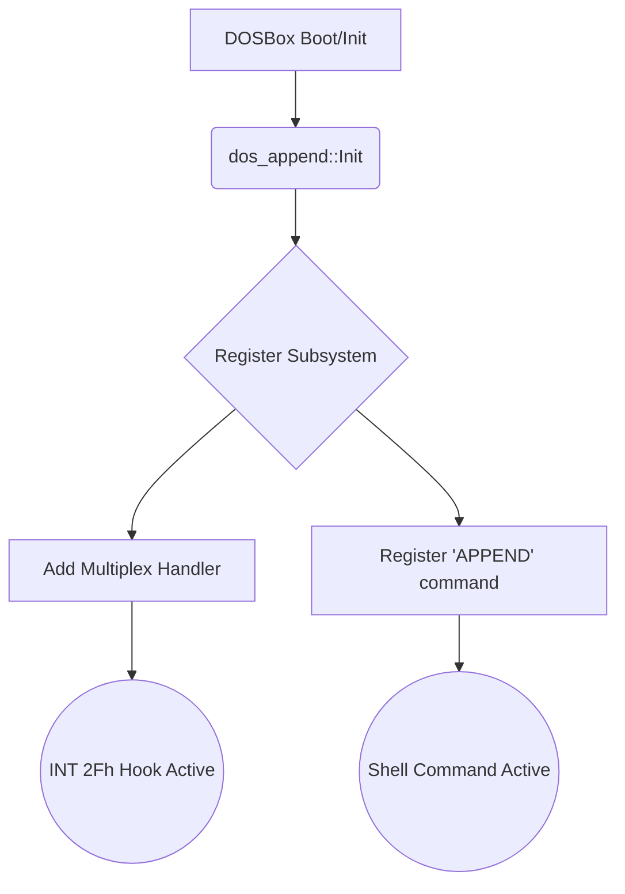
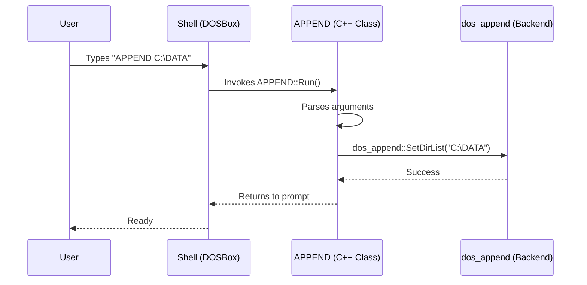

# APPEND Subsystem Pull Request Draft

## Introduction
The `APPEND` utility allows DOS applications to open data files in specified directories as if they were in the current working directory. 

Because DOSBox Staging reports itself to applications as MS-DOS 5.0, this implementation of `APPEND` aligns its behavior, interrupt hooks, and version reporting with MS-DOS 5.0 specifications. *Note: Since the MS-DOS 5.0 source code is not publicly available, we used the open-source MS-DOS 4.0 `APPEND.ASM` release as our ground-truth reference for internal logic, adapting it for DOS 5.0.*

## Historical Context: What actually used APPEND?
While `PATH` was used to find executables (`.EXE`, `.COM`, `.BAT`), `APPEND` was introduced in DOS 3.3 to solve the same problem for **data files**. 

Many early MS-DOS games (such as older Sierra On-Line titles), productivity tools ported from CP/M (like WordStar), and early compilers (like Turbo C) were not "directory aware." They were hardcoded to look for their configuration files, level data, or overlays in the *current working directory*. 

Without `APPEND`, if you wanted to run a game from a different folder, you had to copy all of its data files into that folder, wasting massive amounts of hard drive space. `APPEND` allowed you to "trick" the application. By typing `APPEND C:\SIERRA\DATA`, the application would ask DOS for a file in the current directory, and APPEND would intercept the request, secretly finding it in `C:\SIERRA\DATA` and handing it to the program.

## Program Lifecycle and Registration

In native MS-DOS, `APPEND` is an **external command** (`APPEND.EXE`). When executed, it loads into conventional memory, parses its arguments, hooks into the CPU's Interrupt Vector Table (specifically `INT 21h` and `INT 2Fh`), and becomes a Terminate and Stay Resident (TSR) program.

In DOSBox Staging, we deviate from this behavior by building `APPEND` directly into the emulator core as an **internal command** via the `dos_append` C++ namespace.



### Why deviate from a standard TSR?
Simulating a TSR inside DOSBox would require loading an actual x86 binary into the emulated DOS memory and executing it inside the emulator. By implementing `APPEND` as a native C++ namespace instead, we achieve several massive benefits:
1. **Performance**: File resolution happens instantly in native C++ rather than executing hundreds of emulated assembly instructions.
2. **Memory**: We save precious bytes in the emulated 640KB conventional memory since the TSR isn't loaded there.
3. **Maintainability**: C++ is significantly easier to test, debug, and trace than emulated x86 assembly.

**Tradeoffs of this approach and how we mitigate them:**
1. **No real memory footprint visible to DOS.** A real TSR would consume conventional memory, and its memory block would be linked in the DOS **Memory Control Block (MCB) chain**. Because of this, diagnostic commands like `MEM /C` would list it. Since our APPEND lives in C++ space, it does not exist in the MCB chain and `MEM` will not show it. This is cosmetic and does not affect game compatibility. The user gets that memory back for free.
2. **Subfunction `04h` (dir_ptr) cannot trivially return a far pointer.** A real TSR stores its directory list inside conventional memory, so returning a 16-bit `ES:DI` pointer to the caller is trivial. Because our `dir_list` is a C++ `std::string`, we must explicitly allocate DOS memory and copy the string into it. We solve this using `DOS_GetMemory` and `MEM_BlockWrite` (detailed below).
3. **Programs that scan the MCB chain for APPEND will not find it.** Some diagnostic utilities walk the DOS MCB chain to enumerate loaded TSRs. Our native implementation is invisible to this scan. No known games rely on this behavior.

### User Flow
When a user types `APPEND C:\DATA` in the DOSBox prompt, the shell parses the arguments and invokes our native C++ command class instead of looking for an external `APPEND.EXE` file.



```cpp
// src/dos/programs/append.cpp
void APPEND::Run()
{
	std::string args = {};
	cmd->GetStringRemain(args);

	// "APPEND ;" clears the list
	if (args == ";") {
		dos_append::SetDirList("");
		return;
	}

	// Set the new directory list in the native backend
	dos_append::SetDirList(args);
}
```

## Multiplex Interrupts (`INT 2Fh, AH = B7h`)
Even though `APPEND` runs natively in C++, legacy DOS applications still expect to communicate with it using the standard `INT 2Fh` multiplex interrupt. To support these programs seamlessly, we register a multiplex handler directly into the DOS kernel during initialization:

```cpp
// src/dos/dos_append.cpp
void Init()
{
	// Hooks our custom function into the INT 2Fh chain
	DOS_AddMultiplexHandler(MultiplexHandler);
}
```

### How DOSBox-Staging Intercepts `INT 2Fh`
In DOSBox Staging (`src/dos/dos_misc.cpp`), the kernel maintains a `std::list` of C++ function pointers for multiplex handlers. 

When the emulated CPU executes an `INT 2Fh` instruction, the DOSBox software interrupt handler pauses emulation, loops through this list of C++ functions, and passes the current CPU registers to each one. This allows native C++ code to intercept software interrupts instantly. This is the exact same mechanism DOSBox uses to implement other internal drivers, like `MSCDEX` (the CD-ROM driver) and the Windows integration drivers.

---

## MS-DOS Ground Truth Reference (`APPEND.ASM`)

To ensure 100% compatibility with software probing the APPEND subsystem, we cross-referenced our C++ handler with the official MS-DOS 4.0 open-source release (`APPEND.ASM`).

### 1. Multiplex Subfunctions Table (`INT 2Fh`, `AH = B7h`)

| Subfunction (`AL`) | Name | MS-DOS 4.0/5.0 Behavior | Implementation Notes for DOSBox |
| :--- | :--- | :--- | :--- |
| **`00h`** | `are_you_there` | Returns `AL = 0xFF` if resident. | **Implemented.** Returns `0xFF`. |
| **`01h`** | `old_dir_ptr` | Aborts APPEND (legacy APPEND 1.0 check). | **Implemented (Stub).** Returns `true` with `LOG_MSG("APPEND: Caught legacy APPEND 1.0 query (AX=B701h)")` to gracefully handle legacy queries. |
| **`02h`** | `get_app_version`| Returns `AX = FFFFh`. | **Implemented.** Returns `AX = 0xFFFF` to signal MS-DOS APPEND (distinguishing it from IBM PC Network APPEND). |
| **`03h`** | `tv_vector` | Synchronizes with IBM TopView. | **Partially Implemented.** Returns `true` with `LOG_MSG("APPEND: Caught IBM TopView process sync command (AX=B703h)")`|
| **`04h`** | `dir_ptr` | Returns a Far Pointer (`ES:DI`) to the APPEND directory list. | **Implemented (See Deep Dive Below).** |
| **`06h`** | `get_state` | Returns APPEND `mode_flags` in `BX`. | **Implemented.** Returns `BX = 0x0001` if enabled, `0x0000` otherwise. |
| **`07h`** | `set_state` | Sets APPEND `mode_flags` from `BX`. | **Implemented.** We safely intercept this and honor the enable/disable bit without crashing legacy apps. |
| **`10h`** | `DOS_version` | Returns DOS version in `DL`/`DH`. | **Implemented.** Returns `DL = dos.version.major` and `DH = dos.version.minor`. |
| **`11h`** | `true_name` | Forces APPEND to write absolute paths into the caller's buffer. | **Implemented.** Handled in `MultiplexHandler` and `DOS_Canonicalize`. |

### Deep Dive: Implementing `AL = 04h (dir_ptr)` in DOSBox
If a DOS program calls `INT 2Fh, AX=B704h`, it expects us to return a 16-bit far pointer (`ES:DI`) pointing to the string containing the active APPEND directories. 

Because DOSBox is an emulator, the calling DOS program runs inside simulated 16-bit segmented memory (typically up to 640KB), while our `dir_list` `std::string` lives in modern 64-bit C++ memory. The DOS program **cannot** read our C++ memory. 

To bridge this gap and implement `04h`, we use DOSBox-internal C++ functions to synchronize our native list with emulated RAM.

#### Memory Synchronization (C++ ↔ DOS)
Because our APPEND lives in two worlds simultaneously, we need to keep the directory list in sync between them. This is a one-directional push from C++ to DOS memory:

1. **`DOS_GetMemory(size)`**: During `Init()`, we use this function to allocate a block inside the emulated 640KB space. It returns a segment number.
2. **`MEM_BlockWrite`**: Whenever the directory list changes, we use this function to copy raw bytes from our C++ `dir_list` into the emulated RAM block.

This guarantees that `dir_list` (C++) and the block in DOS memory are always identical. We can safely set `reg_es = Segment` and `reg_di = Offset` before returning to the caller.

> [!NOTE]
> **Testing `ES:DI` Pointers in C++ (The `reg_es` Bug)**
> During the implementation of the unit tests for subfunction `04h` (`MultiplexDirPointer` in `dos_append_tests.cpp`), the initial test code failed to build because it attempted to read the DOSBox simulated `ES` register directly using a variable named `reg_es`.
> 
> **What happened and why:** In DOSBox Staging's C++ codebase (`src/cpu/registers.h`), general-purpose registers (like `AX`, `DI`, etc.) have direct accessors like `reg_al`, `reg_di`, or `reg_eax`. However, Segment registers (`CS`, `DS`, `ES`, `SS`, `FS`, `GS`) are more complex and do not have these direct variables. They must be accessed through the `SegValue()` function. By replacing `reg_es` with `SegValue(es)`, the tests compiled successfully. This highlights the bridge between writing C++ assertions and interacting with the Emulated World's CPU state.

### 2. Mode Flags (`mode_flags`) Truth Table

The original APPEND TSR managed its configuration through a 16-bit word called `mode_flags`. When calling subfunctions `06h` (Get State) or `07h` (Set State), these bits are passed in the `BX` register. 

These flags operate using **Bitwise Logic**. To enable multiple features, MS-DOS combined them using Bitwise OR (`|` in C++, or `+` in Assembly macros). For example, if APPEND is Enabled (`0001h`) and allows Drives (`1000h`) and Paths (`2000h`), the resulting bitmask is `2000h | 1000h | 0001h = 3001h`.

| Bitmask (Hex) | Name | Description |
| :--- | :--- | :--- |
| **`8000h`** | `X_mode` | `/X` switch active (execute file searches). |
| **`4000h`** | `E_mode` | `/E` switch active (store APPEND in DOS environment). |
| **`2000h`** | `Path_mode` | Allow directory paths in the requested filename. |
| **`1000h`** | `Drive_mode` | Allow drive letters in the requested filename. |
| **`0001h`** | `Enabled` | Overall APPEND enabled/disabled flag. |

### 3. Assembly Logic Breakdown (`INT 2Fh`)

Below is the side-by-side comparison of the actual MS-DOS Assembly code for the Multiplex handler (`do_appends`) and what the code is fundamentally doing.

| MS-DOS Assembly Code (`APPEND.ASM`) | Functional Breakdown / Explanation |
| :--- | :--- |
| `cmp al,are_you_there` <br> `jne ck1` <br> `mov al,-1` <br> `iret` | **1. Installation Check (`AL=00h`)** <br> Checks if `AL == 0`. If true, sets `AL = 0xFF` (-1) and returns to caller to indicate APPEND is active. |
| `ck1:` <br> `cmp al,dir_ptr` <br> `jne ck2` <br> `les di,dword ptr dirlst_offset` <br> `iret` | **2. Get Directory Pointer (`AL=04h`)** <br> Checks if `AL == 4`. If true, loads the segment and offset (`ES:DI`) of the internal string containing the APPEND paths and returns. |
| `ck2:` <br> `cmp al,get_app_version` <br> `jne ck3` <br> `mov ax,-1` <br> `iret` | **3. Legacy Version Check (`AL=02h`)** <br> Checks if `AL == 2`. If true, sets `AX = 0xFFFF` (-1). This specifically signals to older applications that this is the MS-DOS built-in APPEND, not the IBM Network APPEND. |
| `ck5:` <br> `cmp al,DOS_version` <br> `jne ck6` <br> `mov ax,mode_flags` <br> `xor bx,bx` <br> `xor cx,cx` <br> `mov dl,byte ptr version_loc` <br> `mov dh,byte ptr version_loc+1` <br> `iret` | **4. Detailed DOS Version Check (`AL=10h`)** <br> Checks if `AL == 10h`. If true, returns `AX = mode_flags`, clears `BX` and `CX`, and returns the major version in `DL` and minor version in `DH`. |
| `ck6:` <br> `cmp al,get_state` <br> `jne ck7` <br> `mov bx,mode_flags` <br> `iret` | **5. Get State (`AL=06h`)** <br> Checks if `AL == 6`. If true, copies the internal `mode_flags` word into `BX` and returns to caller. |
| `ck7:` <br> `cmp al,set_state` <br> `jne ck8` <br> `mov mode_flags,bx` <br> `iret` | **6. Set State (`AL=07h`)** <br> Checks if `AL == 7`. If true, copies the user-provided `BX` register into the internal `mode_flags` word, modifying APPEND's configuration. |

### 4. Intercepted DOS APIs (`INT 21h`)

APPEND operates by hooking `INT 21h` and monitoring specific file-related operations. Below is a comparison of what native MS-DOS intercepts versus what DOSBox Staging currently implements natively in our C++ layer (`src/dos/dos_append.cpp`).

| Hex | Constant Name | Description | DOSBox-Staging Implementation Status |
| :--- | :--- | :--- | :--- |
| **`0Fh`** | `FCB_opn` | Open File via FCB | **Implemented.** (Handled in `DOS_FCB::Open`). |
| **`11h`** | `FCB_sch1` | Find First File via FCB | **Not Implemented.** (Not hooked in `DOS_FCBFindFirst`). |
| **`23h`** | `file_sz` | Get File Size via FCB | **Not Implemented.** (Indirect via `DOS_OpenFile`). |
| **`3Dh`** | `handle_opn` | Open File via Handle | **Implemented.** (Handled in `DOS_OpenFile`). |
| **`4Bh`** | `exec_proc` | Execute Program (EXEC) | **Implemented.** (Handled in `DOS_Execute`). |
| **`4Eh`** | `handle_fnd1`| Find First File via Handle | **Not Implemented.** (Not hooked in `DOS_FindFirst`). |
| **`57h`** | `dat_tim` | Get/Set File Date and Time | **Not Implemented.** See note below. |
| **`6Ch`** | `ext_handle_opn`| Extended Open/Create | **Implemented.** See note below. |

#### Note on `57h` (Get/Set File Date and Time)
While `APPEND.ASM` defines the `dat_tim` macro at the top of the file, the source code actually **never implements or intercepts** `INT 21h, AH=57h`. This makes logical sense: `57h` operates on an already-open file handle, not a file path. By the time a program asks for a file's timestamp, `APPEND` has already resolved the path during the `Open` (`3Dh`) call. We do not need to implement this.

#### Note on `6Ch` (Extended Handle Open)
`6Ch` is an API call introduced in DOS 4.0 as an "Extended Open" function. **Important**: This has *nothing* to do with Extended Memory (XMS/EMS). "Extended" simply means it takes extra arguments in CPU registers (like `NO-INHERIT`, `COMMIT`, or specific sharing modes) that the traditional `3Dh` Open function didn't support. This function is fully implemented by resolving APPEND search paths at the start of `DOS_OpenFileExtended` before invoking file open or create operations, ensuring operations like Action `02h` (replace existing file) correctly target files found in APPEND directories.
